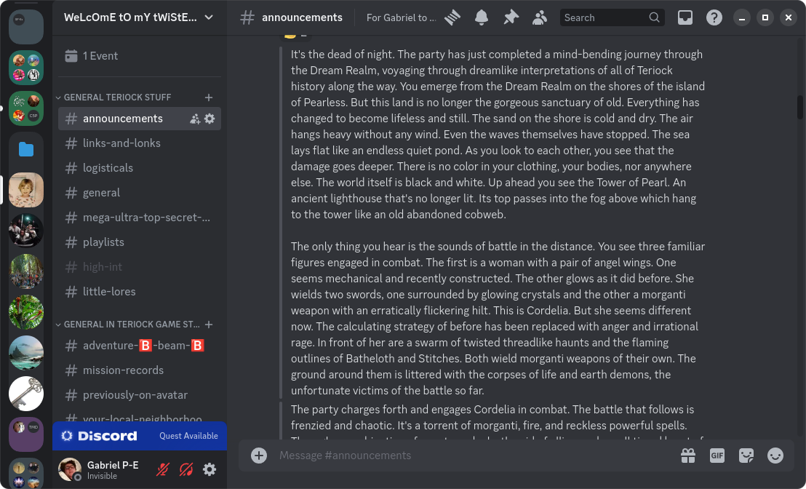
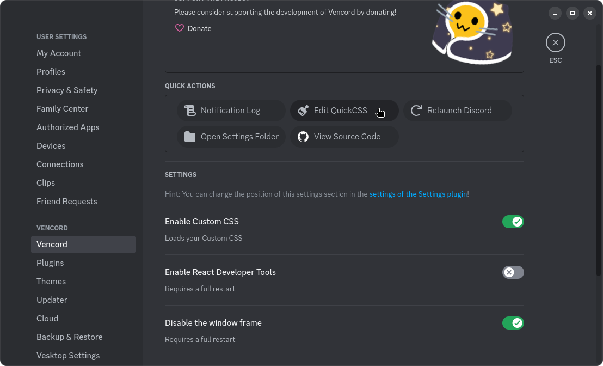
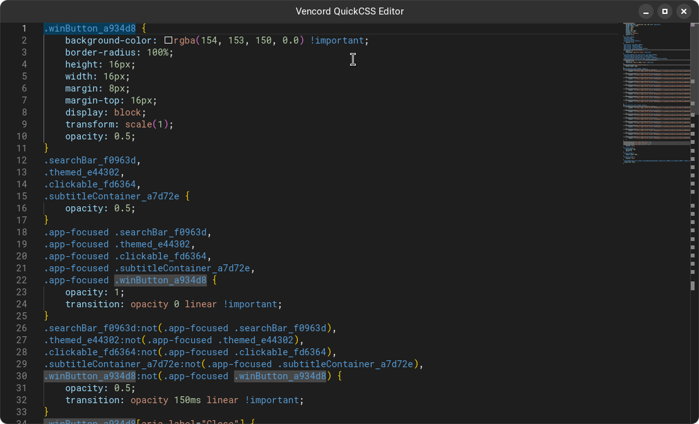

# Discord CSD GNOME

Native looking client side decorations for Discord on GNOME!

This is a hacky little script I made to create custom CSS to give Discord window decorations that match the current GNOME icon theme. There are pre-made CSS files for Adwaita, Papirus, and Yaru.

## Installation

To install, you need a Discord client (such as [Vesktop](https://flathub.org/apps/dev.vencord.Vesktop)) that both allows for custom CSS and has the option to provide a frameless version of Discord.

## Caveats

I haven't tested the `make-css.py` script with icon themes other than Adwaita, Yaru, and Papirus. I can't guarantee it works for them. There's also no support for styles other than Libadwaita. Also, I cannot guarantee that the Discord CSS theme won't have some bugs that pop up form time to time.